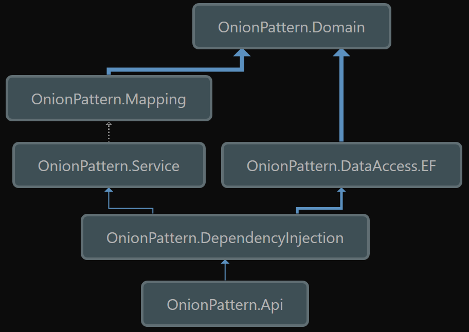

# Onion Pattern (Onion Architecture)

#### Table of Contents:
 * [Overview](#overview)
 * [Documentation](#documentation)
 * [Prerequisites](#prerequisites)
 * [Features](#features)
 * [Architecture](#architecture)
 * [Helpful Links](#helpfullinks)

####  Overview {#overview}:
This is a project in which I am creating myself an example of Onion Patter/Onion Architecture. To perform this we need loosely
coupled code, so understanding Dependency Injection is helpful. See Jeffrey Palermo article below for description of what 
Onion Architecture is.

 *[Overview - Jeffrey Palermo](http://jeffreypalermo.com/blog/the-onion-architecture-part-1/)

#### Documentation {#documentation}:
 * [Microsoft Documentation](https://docs.microsoft.com/en-us/)
 * [Dot Net Documentation](https://docs.microsoft.com/en-us/dotnet/)
 * [.NET Standard](https://docs.microsoft.com/en-us/dotnet/standard/net-standard)
 * [Dependency Injection in .NET](https://www.amazon.com/gp/product/1935182501/ref=oh_aui_detailpage_o09_s00?ie=UTF8&psc=1)

#### Prerequisites: {#prerequisites}
 * [.NET Core 2](https://www.microsoft.com/net/core#windowscmd)
 * [Visual Studio ](https://www.visualstudio.com)
 * [SQL Server Developer Edition](https://www.microsoft.com/en-us/sql-server/sql-server-downloads) - Optional [Run InMemory Database is Available]

#### Features {#features}:
 * [FakeItEasy](https://fakeiteasy.github.io)
 * [FluentAssertions](http://fluentassertions.com)
 * [Swagger UI](https://swagger.io/swagger-ui/) - Api Tester
 * [Serilog](https://serilog.net)
 * [AutoMapper](http://automapper.org)

#### Architecture {#architecture}:

#### Helpful Links {#helpfullinks}:
 * [Markdown Guide](https://guides.github.com/features/mastering-markdown/)
